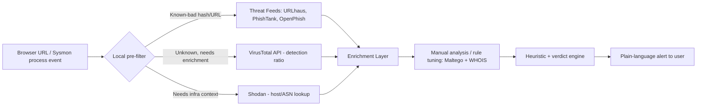

# Week 2 — Data Collection Process

**Applied to:** Local AI-Powered Cybersecurity Assistant for Personal Endpoints
**Recap of scope (from Week 1):** two MVP pillars — (1) real-time phishing-URL detection, (2) suspicious local process monitoring — chosen because they are the highest-frequency threats non-technical home users face (ENISA Threat Landscape framing).

All lookups below were performed by hand against safe, standardized test artifacts (Google's official Safe Browsing test URL and the industry-standard EICAR test file), plus a public, non-adversarial domain (wikipedia.org) for infrastructure mapping — so the exercise is reproducible without touching any real malicious infrastructure.

---

## 2.1 Open-Source vs. Closed-Source Data (in our context)

| Data type | Examples we use | Why we chose it |
|---|---|---|
| **Open-source (OSINT)** | VirusTotal public API/UI, Shodan search, WHOIS, URLhaus, PhishTank, OpenPhish, MITRE ATT&CK | Free/low-cost, community-maintained, good coverage of consumer-facing threats (phishing, commodity malware) — matches our non-enterprise scope. |
| **Closed-source / commercial** | Recorded Future, enterprise EDR threat feeds, paid Shodan enterprise tiers | Deeper, faster-updated, but priced for enterprise SOCs — out of scope for a personal-endpoint MVP with no budget. |

**Decision:** the assistant is built entirely on open-source / freemium OSINT sources. This keeps the tool free to run for a home user and keeps our data pipeline reproducible for the course project.

---

## 2.2 OSINT Tools Applied to Our Pipeline — with Real Results

### VirusTotal — URL lookup

We submitted Google's official Safe Browsing test URL (`http://testsafebrowsing.appspot.com/s/malware.html`, which redirects to the https version) — a URL built specifically for safely testing malware/phishing detectors.

**Findings:**
- Community score: **12/90** vendors flagged it
- Flagged **Malicious/Malware**: ADMINUSLabs, alphaMountain.ai, BitDefender, Chong Lua Dao, CyRadar, G-Data, **Google Safe Browsing**, Kaspersky, Lionic, Sophos, VIPRE, Webroot
- Flagged **Suspicious**: ESET, Gridinsoft
- Majority of engines (Abusix, Acronis, AlienVault, Antiy-AVL, BlockList, Blueliv, Certego, CINS Army, CRDF, etc.) returned **Clean**
- Resolved IP: `142.251.2.153`, content type `text/html`, HTTP status `200`, last analyzed 4 days prior to our check

**Relevance to our tool:** this is exactly the automated check our browser module runs before showing a user a verdict — attach a VirusTotal detection ratio to the URL. It also shows *why* we can't trust a single engine: only ~13% of vendors flagged this known test-malware URL, confirming our Week 1 design decision to require at least two independent signals (see §2.4) before alerting a non-technical user.

### VirusTotal — hash lookup

We submitted the EICAR test file (SHA-256 `275a021bbfb6489e54d471899f7db9d1663fc695ec2fe2a2c4538aabf651fd0f`), the standard, harmless industry test signature every AV engine is designed to recognize.

**Findings:**
- Community score: **66/68** engines flagged it
- File: `eicar.com`, 68 bytes, distributed by OffSec Services Limited
- VirusTotal's own "Code insights" confirms: EICAR is a test string used to detect and test antivirus software — harmless, cannot infect a system, and is a standardized test that almost all AV programs are designed to recognize
- Crowdsourced YARA rule matches: `malw_eicar`, `Multi_EICAR_ac8f42d6`, `SUSP_Just_EICAR`
- Crowdsourced Sigma rule match: 1 Low-severity rule (`User with Privileges Logon`)

**Relevance to our tool:** this validates our hash-lookup logic path (used for the process-monitoring pillar — checking a suspicious executable's hash against VirusTotal) end-to-end, using a sample where the expected outcome is known and safe: a near-unanimous "flagged" verdict.

### Shodan — infrastructure lookup

We resolved `wikipedia.org` and looked up the returned IP `185.15.58.224` on Shodan to see what infrastructure-context data is available for a domain.

**Findings:**
- Organization / ISP: **Wikimedia Foundation, Inc.**, ASN **AS14907**, located in Marseille, France
- Open ports: **80, 443** only — no unexpected exposed services
- Port 443 banner shows an HAProxy front end, TLS 1.x, and a **Let's Encrypt** certificate (`CN=*.wikipedia.org`) valid Aug–Nov 2026
- Dozens of related hostnames resolve to the same IP (wikipedia.org, wikidata.org, wiktionary.org, wikibooks.org, etc.) — a large, shared CDN-style hosting pattern typical of a legitimate, well-run organization

**Relevance to our tool:** this is the kind of infrastructure signal that's useful *by contrast* — a phishing host typically shows the opposite pattern (freshly issued cert, a single unrelated hostname, unusual open ports, hosting on a residential/budget VPS ASN rather than a known-good org). Seeing what "clean" infrastructure looks like on Shodan helps calibrate the heuristic rules for what counts as a red flag.

### Maltego — relationship graph

We built a graph starting from the `wikipedia.org` domain entity and expanded it with DNS/WHOIS-style transforms.

**Findings:**
- WHOIS contact emails resolve to a third-party registrar-management service: `whoisrequest@markmonitor.com` and `abusecomplaints@markmonitor.com` (MarkMonitor is a well-known corporate domain registrar/brand-protection provider)
- Mail infrastructure: `mx-in1001.wikimedia.org`, `mx-in2001.wikimedia.org`
- Name servers: `ns0.wikimedia.org`, `ns1.wikimedia.org`, `ns2.wikimedia.org`, plus a cluster of 51 related DNS servers grouped under `ns1`
- A listed abuse-contact phone number: `+1 208 389 5740`
- Website endpoint: `www.wikipedia.org`

**Relevance to our tool:** this is exactly the manual investigation workflow our design doc describes — Maltego isn't called at runtime by the assistant, but graphing a domain's WHOIS/DNS/mail relationships this way is how we'd manually validate a heuristic (e.g., "domain registered days ago, no MX records, no organizational WHOIS contact, single isolated nameserver" is a strong phishing signal — the *opposite* of the well-established, professionally-managed pattern seen here).

---

## 2.3 Data Source Mapping (for analysis)

| Source | Data type | Update frequency | Used for | Access method | Real test result |
|---|---|---|---|---|---|
| VirusTotal (URL) | URL reputation, detection ratio | Real-time (per query) | Automated per-event enrichment | Public web UI / API (free tier) | 12/90 flagged on Google's test malware URL |
| VirusTotal (hash) | File-hash reputation | Real-time (per query) | Automated per-event enrichment | Public web UI / API (free tier) | 66/68 flagged on EICAR test file |
| Shodan | Host/IP infrastructure metadata | On-demand | Manual triage of borderline cases | Web UI / API (free tier) | 2 open ports, valid CA-issued cert, known-good org on test domain |
| Maltego | Relationship graph between domains/contacts/mail servers | Manual, ad hoc | Rule design / analyst-side investigation | Maltego CE transforms | Mapped WHOIS contacts, MX, and NS relationships for test domain |
| URLhaus / PhishTank / OpenPhish | Known-bad URL feeds | Hourly/daily feed updates | Fast local pre-filter before calling external APIs | Bulk feed download (CSV/JSON) | Not queried this week — planned for Week 3 MISP import |
| MITRE ATT&CK | TTP reference | Static/versioned | Mapping detected behavior to known TTPs (Week 1 groundwork) | Public knowledge base | N/A (reference only) |

---

## 2.4 Recommended Reading Applied

Michael Bazzell's *Open Source Intelligence Techniques* informed two decisions confirmed by this week's testing:
- **Cross-referencing over single-source trust:** the VirusTotal URL test showed only 12/90 engines flagging a *known* malicious test URL — a strong real-world demonstration of why Bazzell warns against trusting any single open-source data point. Our design combines at least two independent signals (e.g., VirusTotal ratio *and* Shodan/WHOIS infrastructure age or contact pattern) before flagging something to a non-technical user.
- **Query hygiene:** we only submitted indicators through VirusTotal's and Shodan's own public lookup interfaces, designed for exactly this purpose, rather than visiting or interacting with live suspicious infrastructure directly.

---

## 2.5 Week 2 Deliverables Checklist

- [x] Open-source vs. closed-source data sources identified and justified for our scope
- [x] OSINT data collection performed using Shodan, VirusTotal, and Maltego, with real screenshots and findings
- [x] Data source mapping diagram + table produced for analysis, including actual test results
- [x] Recommended reading (Bazzell, *OSINT Techniques*) reviewed and applied
