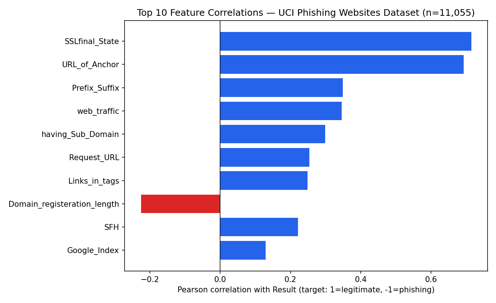
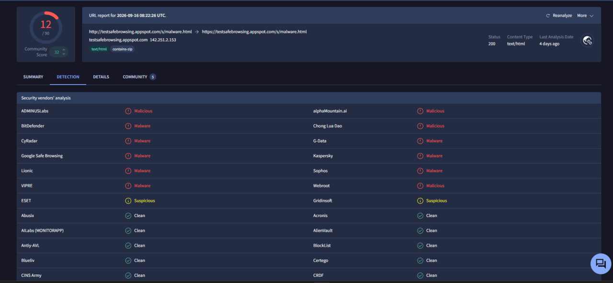
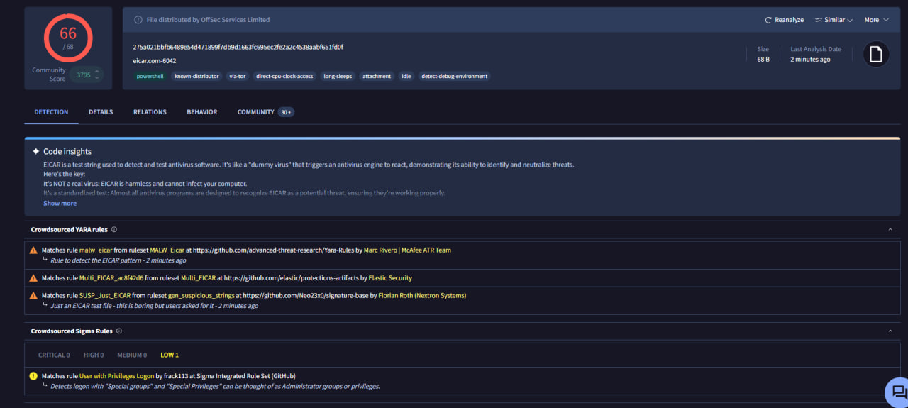
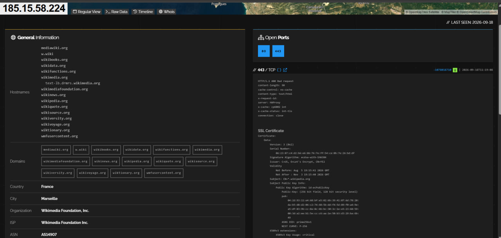
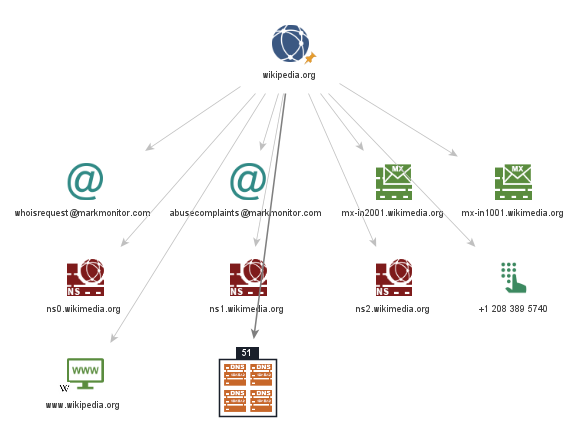
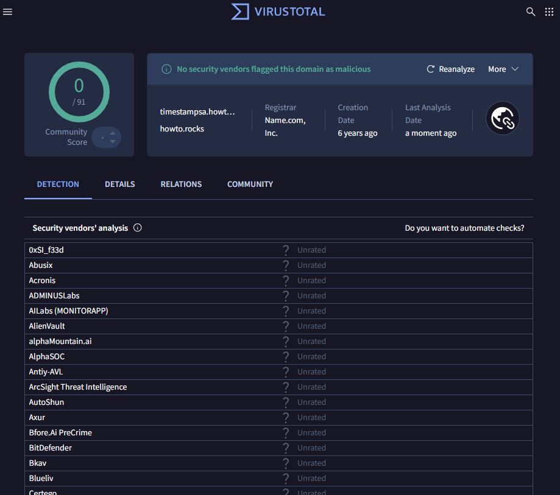
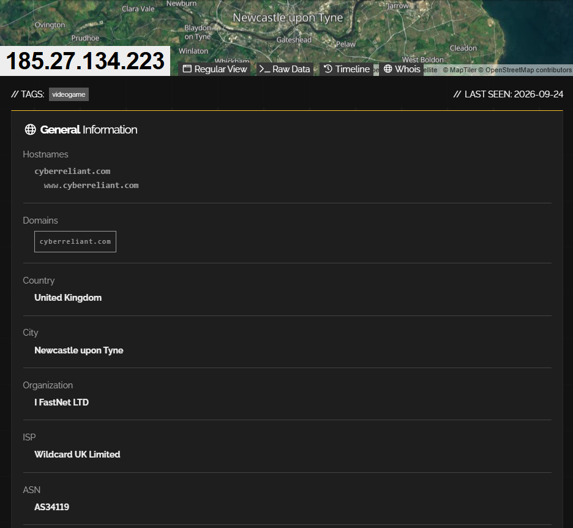
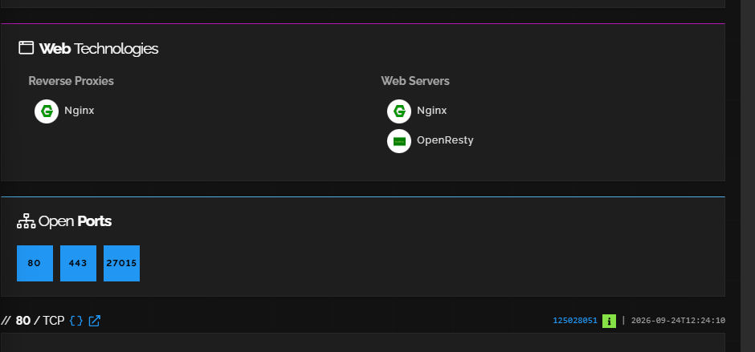
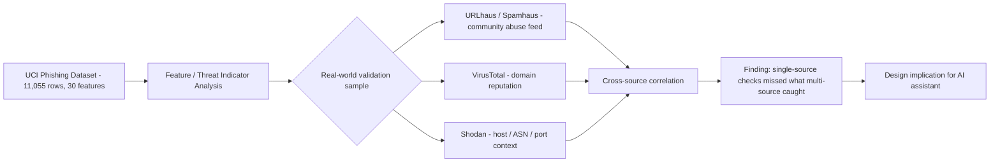

# Week 2 — Data Collection Process

**Applied to:** Local AI-Powered Cybersecurity Assistant for Personal Endpoints
**Recap of scope (Week 1):** two MVP pillars — (1) real-time phishing-URL detection, (2) suspicious local process monitoring — chosen because they are the highest-frequency threats non-technical home users face (ENISA Threat Landscape framing).

**Research question:** Which URL and infrastructure characteristics can be used as useful indicators for identifying phishing websites in a local AI-powered cybersecurity assistant?

- **RQ1:** Which characteristics in a real phishing dataset are most strongly associated with phishing websites?
- **RQ2:** Can external OSINT sources (VirusTotal, Shodan, community abuse feeds) provide additional threat-intelligence context beyond a static dataset?
- **RQ3:** Does combining multiple independent indicators provide stronger evidence than relying on a single indicator?

---

## 1. Open-Source vs. Closed-Source Data

| Data type | Examples we use | Why we chose it |
|---|---|---|
| **Open-source (OSINT)** | UCI phishing dataset, VirusTotal, Shodan, URLhaus/Spamhaus, WHOIS, MITRE ATT&CK | Free/low-cost, community-maintained, good coverage of consumer-facing threats — matches our non-enterprise scope |
| **Closed-source / commercial** | Recorded Future, enterprise EDR feeds, paid Shodan tiers | Deeper, faster-updated, but priced for enterprise SOCs — out of scope for a personal-endpoint MVP with no budget |

**Decision:** the assistant is designed entirely around open-source / freemium data, keeping it free to run for a home user and fully reproducible for this course project.

---

## 2. Dataset Selection & Verification

**Dataset:** UCI Machine Learning Repository — *Phishing Websites* (Dataset ID 327)
**Citation:** Mohammad, R. & McCluskey, L. (2012). *Phishing Websites* [Dataset]. UCI Machine Learning Repository. https://doi.org/10.24432/C51W2X. License: CC BY 4.0.
**Source:** https://archive.ics.uci.edu/dataset/327/phishing

We downloaded the full dataset package (`Training Dataset.arff` + `Phishing Websites Features.docx`) and verified it directly rather than trusting the catalog page numbers blindly:

| Property | Claimed (UCI page) | Verified (our own parsing) |
|---|---|---|
| Instances | 11,055 | **11,055** ✅ |
| Features | 30 | **30** (+1 target column `Result`) ✅ |
| Missing values | None | **0 missing values** ✅ |
| Feature type | Categorical (-1 / 0 / 1) | Confirmed |

The features were extracted by the original researchers from real phishing URLs (sourced from the PhishTank and MillerSmiles archives) and real legitimate URLs (via Google search), then engineered into rule-based indicators — **the dataset itself does not retain the original URLs**, only the derived feature values. This is an important methodological constraint addressed in §6.

---

## 3. Dataset Exploration

- **Shape:** 11,055 rows × 31 columns
- **Duplicate rows:** 5,206. *Note:* since every feature is categorical with only 2–3 possible values, many genuinely different real-world websites can land on an identical feature vector — this is a property of the encoding, not a data-quality defect, and is addressed as a limitation in §9.
- **Class balance:** 55.7% legitimate (`Result = 1`), 44.3% phishing (`Result = -1`) — reasonably balanced, no resampling needed.

---

## 4. Threat Indicator Identification

We computed each feature's Pearson correlation with the `Result` label to rank real predictive strength, rather than assuming importance from the literature alone.

| Feature | r | What it measures | Real-time feasibility for our assistant |
|---|---|---|---|
| `SSLfinal_State` | 0.715 | Certificate trust level and age (reputable certs are typically ≥2 years old per the original researchers' analysis) | **Instant, local** — cert data is available client-side |
| `URL_of_Anchor` | 0.693 | Share of `<a>` link targets pointing off-domain or nowhere (`href="#"`) | Needs DOM parsing — feasible in a browser-extension module |
| `Prefix_Suffix` | 0.349 | Dash inserted into the domain to mimic a brand (e.g. `confirme-paypal.com`) | Instant, local — pure string check |
| `web_traffic` | 0.346 | Site popularity/traffic ranking | Needs external ranking data — Alexa (used by the original study) is now discontinued, a real constraint (see §9) |
| `having_Sub_Domain` | 0.298 | Extra subdomain levels beyond `www.` | Instant, local |
| `Request_URL` | 0.253 | Whether embedded objects (images/scripts) load from another domain | Needs DOM parsing |
| `Links_in_tags` | 0.248 | Whether `<meta>/<script>/<link>` tags point off-domain | Needs DOM parsing |
| `Domain_registeration_length` | −0.226 | Domain registration length (short registration → phishing signal) | Needs a WHOIS lookup — this is exactly where our OSINT enrichment layer belongs |

**Design implication:** `SSLfinal_State`, `Prefix_Suffix`, and `having_Sub_Domain` are free, instant, local checks — our first-line filter. `URL_of_Anchor`, `Request_URL`, and `Links_in_tags` require DOM parsing — a second local layer. `web_traffic` and `Domain_registeration_length` require external data, which is precisely the role of the VirusTotal/Shodan enrichment layer in our pipeline.

---

## 5. OSINT Tool Validation (Safe Test Artifacts)

Before investigating a real flagged domain, we validated our OSINT methodology and tooling against safe, standardized test artifacts, so we could confirm our lookup process works correctly on a known expected outcome.

### VirusTotal — known-safe test URL
We submitted Google's official Safe Browsing test URL (`testsafebrowsing.appspot.com/s/malware.html`), built specifically for testing detectors safely.

Result: **12/90** vendors flagged it (including Google Safe Browsing, BitDefender, Kaspersky, Sophos), while the majority returned Clean — an early real demonstration that no single engine catches everything.

### VirusTotal — EICAR test file hash
We submitted the EICAR test file (SHA-256 `275a021bbfb6489e54d471899f7db9d1663fc695ec2fe2a2c4538aabf651fd0f`), the harmless industry-standard AV test signature.

Result: **66/68** engines correctly flagged it, validating our hash-lookup logic end-to-end for the process-monitoring pillar.

### Shodan — clean infrastructure baseline
We resolved `wikipedia.org` and checked its IP on Shodan to establish what "clean" infrastructure looks like.

Result: Wikimedia Foundation, Inc., AS14907, only ports 80/443 open, valid Let's Encrypt certificate, dozens of legitimately related hostnames sharing the IP.

### Maltego — relationship graph baseline
We built a graph from the `wikipedia.org` domain entity.

Result: professionally managed WHOIS contacts (MarkMonitor), proper MX/NS records — the pattern of an established, well-run organization.

---

## 6. OSINT Sample Selection Strategy

**Constraint:** the UCI dataset contains no URLs, only derived feature values, so a dataset row cannot literally be pasted into VirusTotal. The academically correct workaround is to validate the *feature-engineering logic* against a **separately sourced, real, currently active malicious indicator** from a public threat-intelligence feed, compared against the clean baseline already established above.

**Selected sample:** `timestampasa.howto.rocks`, currently listed on **URLhaus** (abuse.ch) and flagged by **Spamhaus DBL** as an "Abused domain (phishing)," first seen 2026-08-06, resolving to `185.27.134.223` (AS34119). We obtained this from URLhaus's own public database listing — a safe lookup interface — without visiting the flagged page itself.

**Address-bar feature read-out (string inspection only, no page visited):**

| Feature | `timestampasa.howto.rocks` |
|---|---|
| IP address instead of domain | No |
| Dash/prefix-suffix trick | No |
| Extra subdomain levels | 1 (`timestampasa.howto`) |
| "https" token stuffed into domain | No |
| Known URL-shortener | No |

None of the classic address-bar tricks are present — an early sign that modern phishing infrastructure has moved past some of the 2012-era heuristics the dataset encodes, and that address-bar checks alone would not catch this case.

---

## 7. VirusTotal & Shodan Investigation — Real Sample

### VirusTotal — domain report

**Findings:** **0/91** vendors currently flag the domain as malicious. Registrar: Name.com, Inc. Domain creation date: **6 years ago**.

This directly contradicts the dataset's own age-of-domain heuristic (§4), which assumes phishing domains are short-lived. We checked this against the dataset itself:

**701 of 4,898 phishing-labeled rows (14.3%) already have a "good/trusted" SSL state**, confirming that a meaningful minority of real phishing cases don't fit the "obviously suspicious" profile the simpler heuristics expect.

### Shodan — infrastructure report

**Findings:** the IP hosts `cyberreliant.com` / `www.cyberreliant.com` — a hostname **unrelated** to the flagged domain — via I FastNet LTD / Wildcard UK Limited (AS34119), Newcastle upon Tyne, UK. Open ports: **80, 443, and 27015** (a Source-engine game-server port, tagged "videogame" by Shodan). Web stack: Nginx + OpenResty behind an Nginx reverse proxy.

### Interpretation

| | Flagged domain (`timestampasa.howto.rocks`) | Clean baseline (`wikipedia.org`) |
|---|---|---|
| VirusTotal verdict | 0/91 — appears clean | (12/90 on a separate known-bad test URL) |
| Domain age | 6 years — appears established | — |
| Hosting pattern | Shared UK infrastructure, hosting an unrelated legitimate business, unusual extra open port | Dedicated, purpose-run infrastructure (Wikimedia) |
| Confirmed status | **Flagged by URLhaus/Spamhaus as abused for phishing** | Never flagged |

**This is the central finding of Week 2:** the attacker did not register fresh, obviously-suspicious infrastructure. Instead, the malicious content appears to be riding on **shared, third-party hosting** — an old, legitimately-registered parent domain and an IP that also serves an unrelated business — a "living off trusted infrastructure" pattern. Neither VirusTotal nor the domain-age heuristic alone caught this; only cross-referencing against a community abuse feed (URLhaus/Spamhaus) revealed the true status.

---

## 8. Data Source Mapping

| Source | Data type | Update frequency | Used for | Access method | Real result this week |
|---|---|---|---|---|---|
| UCI Dataset | Engineered phishing/legitimate features | Static (2012 study, published 2015) | Ranking candidate indicators | Direct download | SSL state & anchor links = strongest predictors |
| URLhaus / Spamhaus | Community-reported abused domains | Continuous | Sourcing a real validation sample | Public web lookup | Flagged `timestampasa.howto.rocks` as abused |
| VirusTotal | Aggregated vendor reputation | Real-time per query | Automated per-indicator enrichment | Public web UI/API | 0/91 on the same domain — disagreed with URLhaus |
| Shodan | Host/IP infrastructure metadata | On-demand | Infra context on borderline cases | Public web UI/API | Shared UK hosting, unrelated legit hostname, unusual open port |
| WHOIS (via VirusTotal) | Domain registration age/registrar | On-demand | Age-based heuristic input | Bundled in VT domain report | 6-year-old domain — contradicted the "young domain" assumption |

---

## 9. Research Findings

**RQ1 — Which characteristics are most strongly associated with phishing?**
`SSLfinal_State` (r=0.715) and `URL_of_Anchor` (r=0.693) dominate, well ahead of classic address-bar tricks. However, 14.3% of phishing-labeled rows still show a "good" SSL state, so no single feature is fully reliable.

**RQ2 — Can external OSINT sources add context beyond the dataset?**
Yes — confirmed directly. The dataset's own age-of-domain assumption and a live VirusTotal check both suggested "this looks fine" for our real sample, but a community abuse feed had already flagged the same host. External OSINT caught what a static, features-only approach missed entirely.

**RQ3 — Does combining multiple indicators outperform relying on one?**
Confirmed empirically. Relying on VirusTotal alone → false sense of safety (0/91). Relying on domain age alone → false sense of safety (6 years old). Only cross-referencing against URLhaus/Spamhaus revealed the correct verdict. This validates Bazzell's core principle — never trust a single open-source data point — with a real, non-hypothetical example.

---

## 10. Limitations

- **Dataset age:** the underlying research is from 2012; some heuristics (e.g., domain age, address-bar tricks) are visibly less effective against the shared-infrastructure abuse pattern observed in our 2026 real-world sample.
- **No raw URLs in the dataset:** limits direct dataset-to-OSINT traceability; validation had to use a separately sourced real indicator instead.
- **Discontinued Alexa ranking:** the `web_traffic` feature's original data source no longer exists, requiring a modern substitute (e.g., Tranco list) for any future implementation.
- **VirusTotal snapshot limitation:** a 0/91 result reflects vendor coverage *at query time* — it is not a permanent guarantee, and can change as vendors update signatures.
- **Shodan snapshot limitation:** infrastructure metadata (open ports, hosting) can change over time and reflects the state at scan time only.
- **Duplicate feature vectors:** 5,206 rows share identical feature combinations due to the coarse categorical encoding, which may understate the dataset's real diversity.
- **Single real-world sample:** our OSINT validation used one confirmed-malicious domain; broader conclusions would need a larger real-world sample.

---

## 11. Connection to the Final Project

| Week 2 output | Contribution to the Local AI-Powered Cybersecurity Assistant |
|---|---|
| UCI dataset + correlation analysis | Evidence-based prioritization of detection rules: SSL and anchor-link checks first, address-bar tricks second |
| Local, string-only features (`Prefix_Suffix`, `having_Sub_Domain`) | Implementable as an instant, zero-latency local pre-filter |
| DOM-based features (`URL_of_Anchor`, `Request_URL`, `Links_in_tags`) | A second local layer, requiring page-source parsing |
| VirusTotal enrichment | External reputation check layer — but proven this week to be insufficient alone |
| Shodan enrichment | Infrastructure-context layer for manual/analyst-side rule tuning |
| Cross-source correlation finding (§7) | **Core design principle going forward:** the assistant must never rely on a single OSINT source before alerting a non-technical user — directly informed by a real case where VirusTotal and domain age both said "safe" while a community feed said otherwise |

---

## 12. References

- Mohammad, R. & McCluskey, L. (2012). *Phishing Websites* [Dataset]. UCI Machine Learning Repository. https://doi.org/10.24432/C51W2X
- ENISA Threat Landscape Report (applied in Week 1 scoping)
- Bazzell, M. *Open Source Intelligence Techniques* (applied throughout §5–9)
- abuse.ch, URLhaus Database — https://urlhaus.abuse.ch/
- VirusTotal — https://www.virustotal.com/
- Shodan — https://www.shodan.io/

---

## Week 2 Deliverables Checklist

- [x] Open-source vs. closed-source data sources identified and justified
- [x] Real cybersecurity dataset selected, verified, and explored (UCI Phishing Websites, 11,055 rows)
- [x] Threat indicators identified and ranked by real correlation with the phishing label
- [x] OSINT tooling validated on safe test artifacts (VirusTotal, Shodan, Maltego)
- [x] Real-world OSINT investigation performed on a currently flagged domain, with a clearly stated sampling method
- [x] Data source mapping produced, including a genuine cross-source discrepancy finding
- [x] Research questions (RQ1–RQ3) answered from actual evidence
- [x] Limitations documented
- [x] Findings connected explicitly to the AI assistant's design
- [x] Recommended reading (Bazzell) applied and validated with a real example
