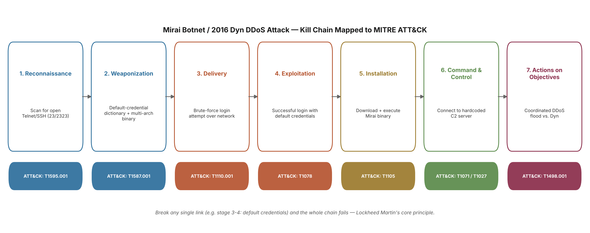

# Week 4 — The Cyber Kill Chain
### Applied to: Local AI-Powered Cybersecurity Assistant for Personal Endpoints

## 4.1 Why This Attack: Connecting to Our Own Week 3 Data

The task is to analyze a real-world cyberattack using the Lockheed Martin Kill Chain and map each stage to MITRE ATT&CK. Rather than picking an arbitrary example, we chose the attack our own project data already pointed to: Week 3's live URLhaus pull showed `mirai` (248 tags) and `Mozi` (216 tags, a Mirai-derived successor) as by far the two largest threat categories in the entire feed — well ahead of classic phishing tags. We analyze the **Mirai IoT botnet**, specifically its best-documented use in the **October 21, 2016 DDoS attack on Dyn**, because it is the real, dominant threat category our own research surfaced, not a textbook example chosen for convenience.

## 4.2 Attack Overview

Mirai is malware that scans the internet for IoT devices (home routers, IP cameras, DVRs) still using factory-default login credentials, infects them, and conscripts them into a botnet. On October 21, 2016, tens of thousands of Mirai-infected devices were used to flood Dyn — a major DNS provider — with traffic, knocking Dyn offline and, with it, access to Twitter, Netflix, Reddit, and other major sites across the US and Europe for several hours.

## 4.3 Kill Chain Stages Mapped to the Attack and to MITRE ATT&CK

| # | Kill Chain Stage | What Mirai Actually Did | ATT&CK Technique |
|---|---|---|---|
| 1 | **Reconnaissance** | Infected devices continuously scanned random internet-wide IP ranges for open Telnet (ports 23/2323) or SSH services — looking for any device that would accept a login attempt. | **T1595.001** – Active Scanning: Scanning IP Blocks |
| 2 | **Weaponization** | The malware was paired with a hardcoded dictionary of 61 common factory-default username/password pairs (e.g. `admin`/`admin`) and cross-compiled for multiple CPU architectures (ARM, MIPS, x86, SPARC) so one payload family could run on almost any IoT device. | **T1587.001** – Develop Capabilities: Malware |
| 3 | **Delivery** | There was no email or web-link delivery step — the live brute-force login attempt over the network connection *was* the delivery mechanism, tried directly against every device found in Reconnaissance. | **T1110.001** – Brute Force: Password Guessing |
| 4 | **Exploitation** | A successful login with a default/weak credential pair handed over a working shell — no software vulnerability was needed, only a credential weakness. | **T1078** – Valid Accounts (Default Credentials) |
| 5 | **Installation** | Once logged in, a small loader downloaded the correct-architecture Mirai binary over `wget`/`tftp`/`curl`, executed it, and deleted the original file from disk to reduce forensic traces. | **T1105** – Ingress Tool Transfer |
| 6 | **Command & Control** | The now-infected device ("bot") connected out to a hardcoded C2 server over a lightweight custom TCP protocol and waited for attack instructions; strings/config data were obfuscated with a simple XOR cipher. | **T1071/T1095** – Application/Non-Application Layer Protocol; **T1027** – Obfuscated Files or Information |
| 7 | **Actions on Objectives** | On command, the botnet launched a massive, coordinated traffic flood. On Oct 21, 2016, roughly 100,000 infected devices overwhelmed Dyn's DNS infrastructure, taking major sites offline for hours. | **T1498.001** – Network Denial of Service: Direct Network Flood |

**A notable absence worth flagging:** classic Mirai deliberately has **no persistence mechanism** — a simple device reboot clears the infection. This was a conscious trade-off favoring scale and reduced forensic footprint over long-term foothold, and it's a useful reminder that not every real attack maps cleanly onto every textbook stage (e.g. Persistence isn't part of the Lockheed Martin 7-stage model at all, but is worth noting against ATT&CK's own tactic list).

## 4.4 Connecting This to Our Project's Scope

Our assistant's MVP targets personal computers — phishing URLs and suspicious local processes on a laptop/phone. But the dominant real threat our own Week 3 data turned up is IoT botnet malware targeting a *different* device class entirely: home routers and cameras, not the laptop itself. This is an honest scope gap, not something to paper over: our current design doesn't watch the router.

It does suggest a natural, low-effort future extension that would directly address the #1 attack vector seen here (stage 3–4: default/weak credentials, not a sophisticated exploit) — a simple "is your router still using its factory password?" check the assistant could run against the local network, reusing the same plain-language verdict style (`✅`/`🟡`/`⚠️`) already built for `simple_url_check.py`. This is noted as a backlog idea, not implemented in this week's deliverable.

## 4.5 Recommended Reading Applied

Lockheed Martin's *Intelligence-Driven Defense* paper argues that breaking the chain at **any single stage** defeats the whole attack — the attacker needs every stage to succeed, the defender only needs to block one. Applied to Mirai: changing a router's default password alone (stopping stage 3–4) would have prevented that specific device from ever being compromised, regardless of how sophisticated the later stages were. This reinforces why our assistant prioritizes catching attacker behavior at the earliest stages we can observe (a suspicious URL before it's clicked, a suspicious process before it does damage) rather than only reacting after Actions on Objectives.

## 4.6 Week 4 Deliverables Checklist

- [x] Real-world cyberattack analyzed using the Lockheed Martin Kill Chain stages (Mirai botnet / Dyn DDoS attack, October 21, 2016)
- [x] Each stage mapped to a corresponding MITRE ATT&CK technique, with reasoning for the mapping
- [x] Choice of attack justified by — and connected to — our own real Week 3 data (`mirai`/`Mozi` as top tags)
- [x] Recommended reading (Lockheed Martin Intelligence-Driven Defense) reviewed — its "break any one link" principle applied to explain why our assistant prioritizes early-stage detection
