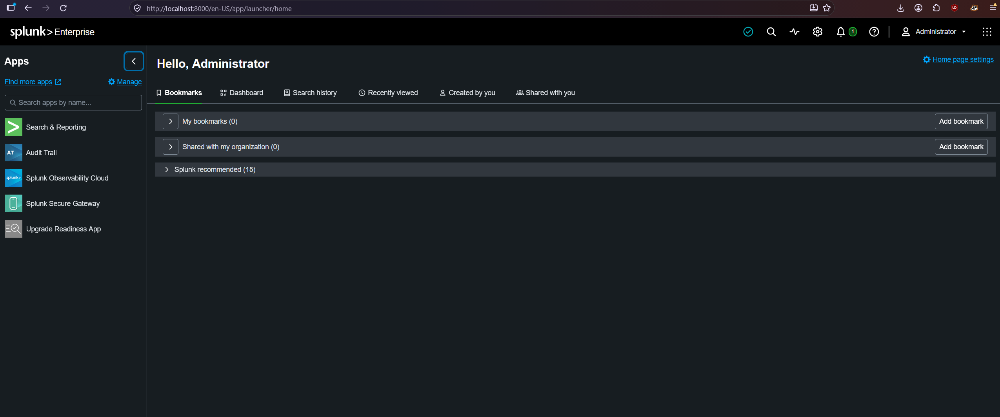
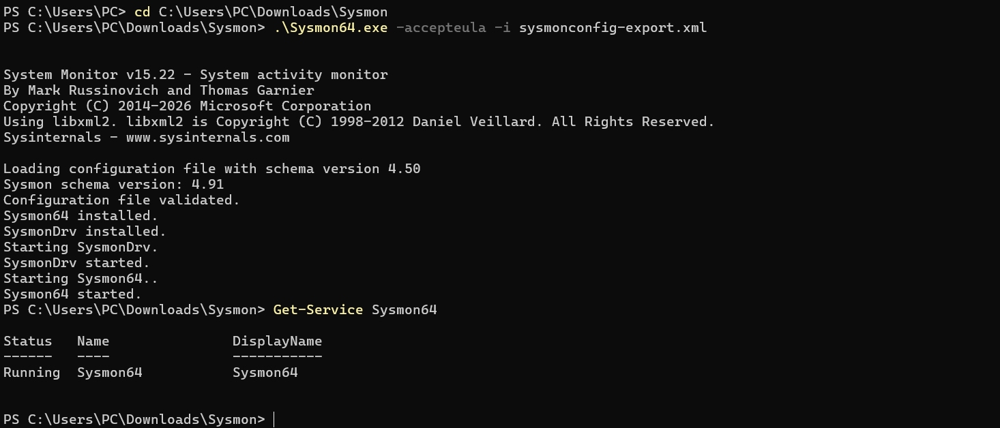
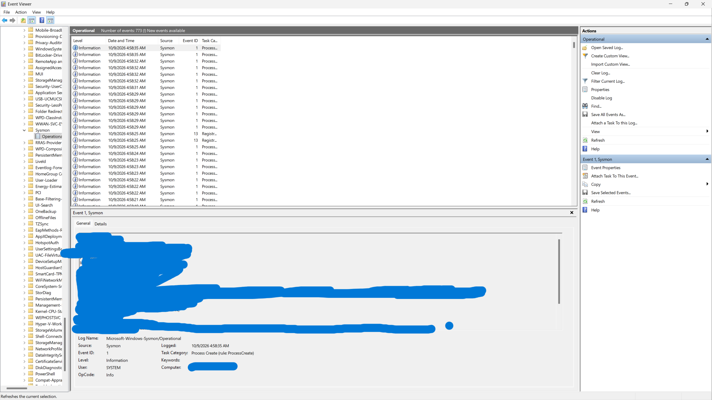
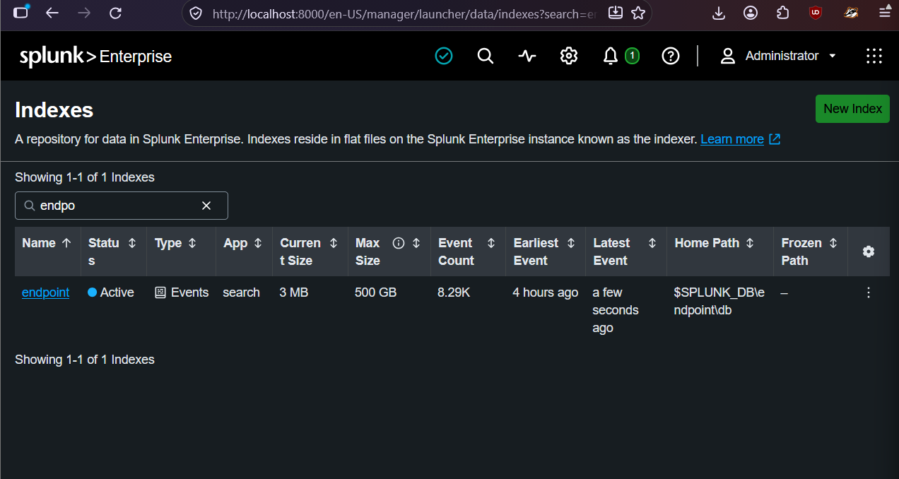
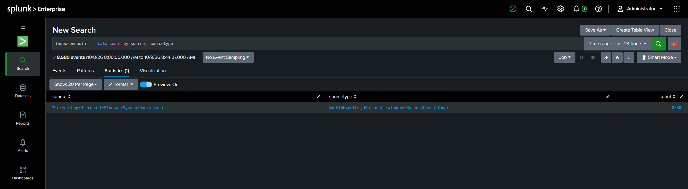
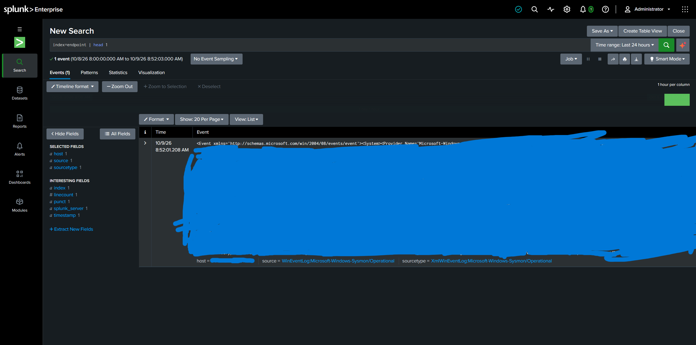
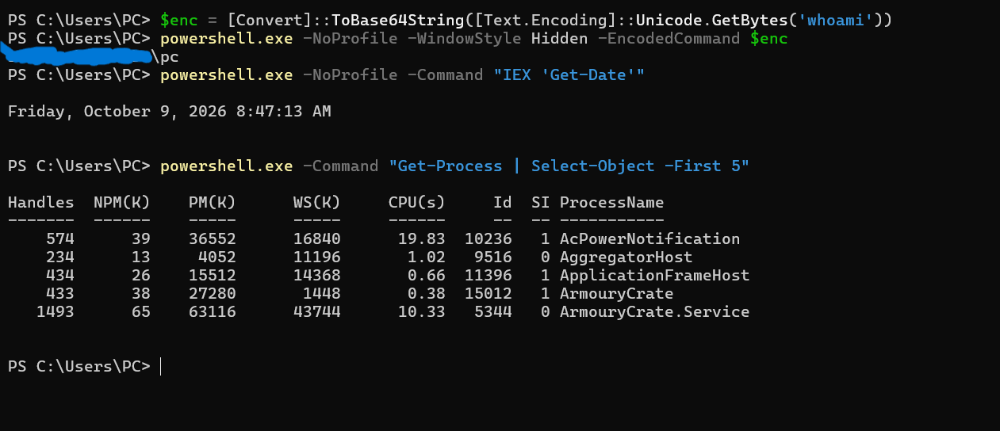
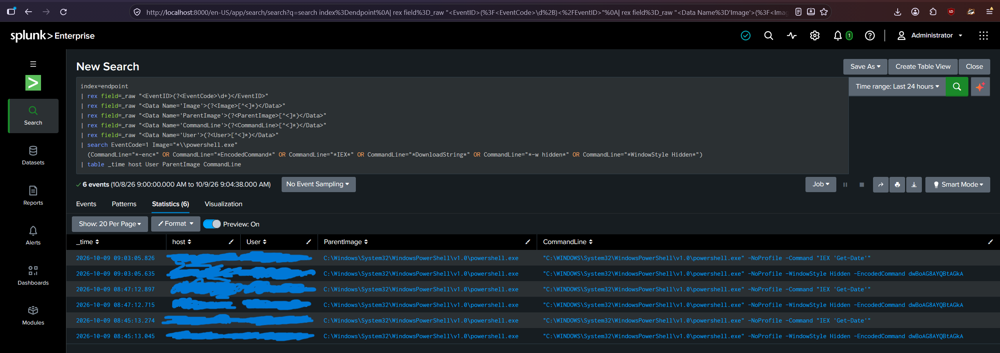
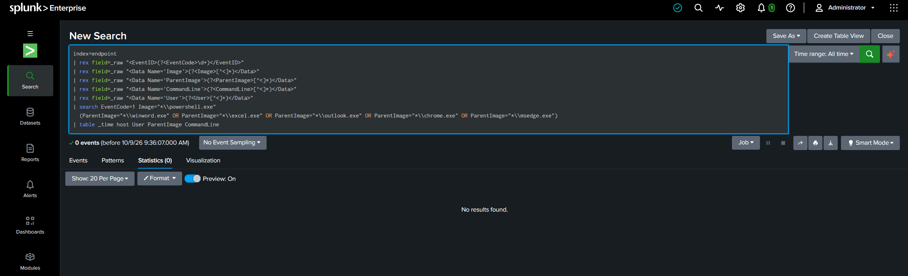
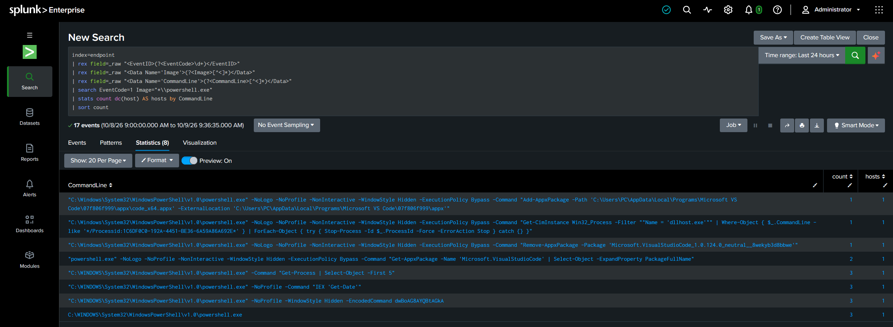

# Week 5 — Threat Hunting Concept

### Applied to: Local AI-Powered Cybersecurity Assistant for Personal Endpoints

## 5.1 Hunting Models

Threat hunting is the proactive search for attacker activity that existing alerts did not catch. Two models are covered this week:

| Model | Starting point | Example | Strength | Weakness |
| ----- | -------------- | ------- | -------- | -------- |
| **Intel-driven** | Known IOCs/TTPs from threat intelligence | Search endpoint logs for the URLhaus domains collected in Week 3 | Fast, concrete, easy to verify | Only finds what is already known; IOCs go stale quickly |
| **Hypothesis-driven** | A testable assumption about attacker behavior, usually mapped to MITRE ATT&CK | "An attacker who got in via phishing runs encoded PowerShell" | Can find unknown or new activity; reusable | Needs good data and analyst skill |

A third approach, **baseline/anomaly-driven** hunting (look for what is rare compared to normal), is used inside the hypothesis hunt below as "least-frequency" analysis (Query 3).

Both models follow the same loop: **Hypothesis → Investigate → Find patterns/TTPs → Turn findings into automated detections**. The last step matters for this project: hunt findings become detection rules for the assistant (section 5.6).

### Reading list

| Source | Type | Used for |
| ------ | ---- | -------- |
| SANS Threat Hunting Summit talks | Conference material | Hunting methodology: starting from a hypothesis, and turning hunts into detections |
| *Practical Threat Hunting*, Phillip Smith | Book | Structure of a hunt: hypothesis, data sources, analysis, and documenting results |
| Microsoft Threat Hunting Guide | Vendor guide | Applying hunts to endpoint telemetry and process-creation events |

**Ideas applied in this week's work:**

- Start from a testable hypothesis mapped to MITRE ATT&CK, rather than from tool output (section 5.2).
- Name the data source before hunting: Sysmon process creation provides the command line and parent process (section 5.2).
- Use the hunting loop to finish the job: findings become a detection rule (section 5.6).
- Record false positives and limitations as part of the result, not as an afterthought (section 5.5).

## 5.2 Hunting Scenario: Suspicious PowerShell Activity

### Hypothesis

> An attacker who gained initial access through a phishing delivery (Week 4 kill chain, *Delivery → Exploitation* stages) is using **PowerShell with obfuscated or download-cradle commands** to execute payloads (*Installation / Command & Control* stages) on an endpoint.

| Item | Value |
| ---- | ----- |
| MITRE ATT&CK | T1059.001 (Command and Scripting Interpreter: PowerShell), T1027 (Obfuscated Files or Information), T1566 (Phishing) as the likely entry point |
| Kill chain link | Week 4: phishing email → user opens document/link → PowerShell launched |
| Data source used | Sysmon Event ID 1 (process creation, including full command line and parent process) |
| What "bad" looks like | PowerShell launched by Office apps or browsers; `-enc`/`-EncodedCommand`; `IEX`, `DownloadString`, `-w hidden`; rare command lines |
| What "benign" looks like | PowerShell started by Explorer, a terminal, or admin scripts with a stable, frequently repeated command line |

**Why this matters to the assistant:** the assistant monitors suspicious local processes. This hunt defines which process behaviors are worth flagging.

## 5.3 Lab Setup

**Platform:** Splunk Enterprise (local install, Windows) with Sysmon as the endpoint telemetry source.

### Step 1: Splunk installed

Splunk Enterprise runs locally at `http://localhost:8000`.



### Step 2: Sysmon installed

Sysmon v15.22 was installed with a community configuration file (`sysmonconfig-export.xml`), and the `Sysmon64` service reports **Running**.



Event Viewer confirms Sysmon is writing to `Applications and Services Logs → Microsoft → Windows → Sysmon → Operational`. The visible events are Event ID 1 (Process Create) and Event ID 13 (Registry value set). Computer name and event details are redacted.



### Step 3: Splunk index and data input

An `endpoint` index was created, and the Sysmon Operational log was added as a Windows event log input in `inputs.conf`:

```
[WinEventLog://Microsoft-Windows-Sysmon/Operational]
disabled = 0
renderXml = true
index = endpoint
```

The index shows as **Active** with about 8.29K events:



### Step 4: Data confirmed arriving

A search over the last 24 hours returned **8,580 events**, all from the Sysmon source:

```spl
index=endpoint | stats count by source, sourcetype
```



A raw event shows the Sysmon data arrives as XML with single-quoted attributes (`<Data Name='Image'>...`). Host and event details are redacted.



### Deviation from the plan: no Sysmon add-on

The *Splunk Add-on for Sysmon* (which normally extracts fields such as `Image`, `ParentImage`, `CommandLine`) returned **no results** on Splunkbase and appears to be archived. Instead, fields are extracted at search time with `rex` directly from the raw XML. This produces the same fields, and keeps the hunt reproducible without any third-party add-on.

### Step 5: Generating test activity

Harmless PowerShell commands were run on the lab machine to simulate the attacker behavior in the hypothesis, plus one normal command as a baseline:

```powershell
$enc = [Convert]::ToBase64String([Text.Encoding]::Unicode.GetBytes('whoami'))
powershell.exe -NoProfile -WindowStyle Hidden -EncodedCommand $enc
powershell.exe -NoProfile -Command "IEX 'Get-Date'"
powershell.exe -Command "Get-Process | Select-Object -First 5"
```



The commands were run three times (at about 08:45, 08:47, and 09:03 on 2026-10-09). Only the first two commands contain hunted indicators; the `Get-Process` command is the benign baseline.

## 5.4 Hunt Queries

Fields are extracted with `rex`, then filtered. The same extraction block is used in all three queries.

**Query 1: Encoded or download-cradle PowerShell**

```spl
index=endpoint
| rex field=_raw "<EventID>(?<EventCode>\d+)</EventID>"
| rex field=_raw "<Data Name='Image'>(?<Image>[^<]*)</Data>"
| rex field=_raw "<Data Name='ParentImage'>(?<ParentImage>[^<]*)</Data>"
| rex field=_raw "<Data Name='CommandLine'>(?<CommandLine>[^<]*)</Data>"
| rex field=_raw "<Data Name='User'>(?<User>[^<]*)</Data>"
| search EventCode=1 Image="*\\powershell.exe"
  (CommandLine="*-enc*" OR CommandLine="*EncodedCommand*" OR CommandLine="*IEX*" OR CommandLine="*DownloadString*" OR CommandLine="*-w hidden*" OR CommandLine="*WindowStyle Hidden*")
| table _time host User ParentImage CommandLine
```

**Query 2: PowerShell spawned by Office apps or browsers (phishing indicator)**

```spl
index=endpoint
| rex field=_raw "<EventID>(?<EventCode>\d+)</EventID>"
| rex field=_raw "<Data Name='Image'>(?<Image>[^<]*)</Data>"
| rex field=_raw "<Data Name='ParentImage'>(?<ParentImage>[^<]*)</Data>"
| rex field=_raw "<Data Name='CommandLine'>(?<CommandLine>[^<]*)</Data>"
| rex field=_raw "<Data Name='User'>(?<User>[^<]*)</Data>"
| search EventCode=1 Image="*\\powershell.exe"
  (ParentImage="*\\winword.exe" OR ParentImage="*\\excel.exe" OR ParentImage="*\\outlook.exe" OR ParentImage="*\\chrome.exe" OR ParentImage="*\\msedge.exe")
| table _time host User ParentImage CommandLine
```

**Query 3: Least-frequency analysis (rare command lines stand out)**

```spl
index=endpoint
| rex field=_raw "<EventID>(?<EventCode>\d+)</EventID>"
| rex field=_raw "<Data Name='Image'>(?<Image>[^<]*)</Data>"
| rex field=_raw "<Data Name='CommandLine'>(?<CommandLine>[^<]*)</Data>"
| search EventCode=1 Image="*\\powershell.exe"
| stats count dc(host) AS hosts by CommandLine
| sort count
```

## 5.5 Results and Findings

### Query 1 result

Query 1 returned **6 events** over the last 24 hours: the encoded command and the `IEX` command, each from the three test runs. The `Get-Process` baseline command was correctly not matched.



The captured encoded argument `dwBoAG8AYQBtAGkA` is Base64 of UTF-16 text. An analyst can decode it to see what the attacker actually ran:

```powershell
[Text.Encoding]::Unicode.GetString([Convert]::FromBase64String('dwBoAG8AYQBtAGkA'))
# Output: whoami
```

This matches the test command that was run, which shows why logging the full command line is valuable: the hidden, encoded command can be recovered and read.

### Query 2 result

Query 2 returned **0 events**. It was run over **All time**, so it covers everything in the `endpoint` index (a few hours of telemetry from one lab machine).



Zero results is a valid hunt outcome here: nothing launched PowerShell from Word, Excel, Outlook, Chrome, or Edge, which is what we expect on a machine with no phishing activity. It is negative evidence only as strong as the data behind it (one host, a few hours).

### Query 3 result

Query 3 grouped all PowerShell process creations in the last 24 hours: **17 events across 8 distinct command lines**, sorted from least to most frequent.



| Count | Command line (shortened) | Interpretation |
| ----- | ------------------------ | -------------- |
| 1 | `-WindowStyle Hidden -ExecutionPolicy Bypass -Command "Add-AppxPackage ... Microsoft VS Code ... code_x64.appx ..."` | Benign: VS Code package registration |
| 1 | `-WindowStyle Hidden -ExecutionPolicy Bypass -Command "Get-CimInstance Win32_Process -Filter ""Name = 'dllhost.exe'"" ... Stop-Process -Force ..."` | Benign (consistent with the same VS Code update flow); force-stops a `dllhost.exe` process |
| 1 | `-WindowStyle Hidden -ExecutionPolicy Bypass -Command "Remove-AppxPackage -Package 'Microsoft.VisualStudioCode_...'"` | Benign: VS Code package removal |
| 2 | `-WindowStyle Hidden -ExecutionPolicy Bypass -Command "Get-AppxPackage -Name 'Microsoft.VisualStudioCode' ..."` | Benign: VS Code package lookup |
| 3 | `-Command "Get-Process \| Select-Object -First 5"` | Our benign baseline test |
| 3 | `-NoProfile -Command "IEX 'Get-Date'"` | Our simulated cradle test |
| 3 | `-NoProfile -WindowStyle Hidden -EncodedCommand dwBoAG8AYQBtAGkA` | Our simulated obfuscation test |
| 3 | `powershell.exe` (no arguments) | Plain interactive shell launches |

All rows come from a single host.

### Summary table

| Query | Events returned | Notes |
| ----- | --------------- | ----- |
| Query 1 (encoded/cradle) | **6** | 3 runs × 2 matching commands; all are our own test commands |
| Query 2 (suspicious parent) | **0** | No PowerShell launched from Office apps or browsers (searched over All time) |
| Query 3 (rare command lines) | **17** events, 8 distinct command lines | Surfaced both test commands, plus four benign VS Code update commands |

### Analysis

- **True positives:** all 6 events from Query 1 are the test commands, so the hypothesis logic detects the simulated behavior. Query 3 also lists both simulated attacker commands.
- **Parent process:** every Query 1 match shows `powershell.exe` as the parent because the commands were typed into an interactive PowerShell window. In a real phishing scenario the parent would be an Office app or browser, which is what Query 2 targets.
- **Rarity is not maliciousness:** the three rarest command lines (count 1) were all VS Code housekeeping, not our test commands. The test commands rank in the middle only because they were run three times; a real attacker's one-off command would also have count 1. Least-frequency analysis is therefore a triage list, not a verdict, and needs context such as parent process, path, and flags.
- **A real false-positive pattern:** the VS Code update commands use `-WindowStyle Hidden -ExecutionPolicy Bypass -NonInteractive`, the same flag combination attackers favor. Query 1 includes `*WindowStyle Hidden*`, so these commands would match it if re-run. They did not appear in the earlier Query 1 run, so they were generated afterwards (consistent with a VS Code update during the lab).
- **Tuning:** treat a hidden window alone as weak evidence. Require it together with an encoded command, `IEX`/`DownloadString`, or a suspicious parent process, and allow-list known software update commands and parent processes.
- **False negatives (limitations):** simple string matching can be evaded, for example with the abbreviated `-e`/`-ec` parameters or string concatenation, which is why Queries 2 and 3 complement Query 1. Query 2 was not validated with a positive control, and the dataset is one machine over a few hours.
- **Noise:** Sysmon also records Splunk's own processes (for example its bundled PostgreSQL), which is why the queries filter on `Image="*\\powershell.exe"` rather than searching all events.
- **Hypothesis outcome:** partially confirmed on test data. Queries 1 and 3 surfaced the simulated encoded and `IEX` PowerShell activity, and Query 2 found no phishing-style parent processes, as expected. The hunt also produced a concrete tuning finding (the VS Code false positive).

## 5.6 Connecting the Hunt to the Assistant

The hunt result becomes a detection rule the assistant can apply to local processes. The rule is implemented in [`powershell_rule.py`](powershell_rule.py) as a function, `check_powershell(command_line, parent_image)`, which takes the same two fields used in the hunt (command line and parent process) and returns whether to flag the process and why.

**Rule logic:**

1. Flag `powershell.exe` when the command line contains an **encoded command**. Any abbreviation of `-EncodedCommand` is matched (`-e`, `-ec`, `-enc`, and so on), which closes the evasion gap of the Splunk string match noted in 5.5. A harmless parameter such as `-Encoding` is not matched.
2. Flag it when the command line contains **`IEX` / `Invoke-Expression` / `DownloadString`**.
3. Flag it when the **parent process is an Office application or browser** (Word, Excel, PowerPoint, Outlook, Chrome, Edge, Firefox).
4. A **hidden window** (`-WindowStyle Hidden`) is **not flagged on its own**, because legitimate installers such as VS Code use it. It is only added as an extra reason when another indicator is already present.
5. A rare command line (Query 3) is a triage signal for ranking what to review, not a standalone alert.

```python
def check_powershell(command_line: str, parent_image: str = "") -> dict:
    reasons = []
    if any(m.lower() in _ENC_FORMS for m in _ENC_RE.findall(command_line)):
        reasons.append("encoded command")
    if _EXEC_RE.search(command_line):
        reasons.append("IEX / Invoke-Expression / DownloadString")
    parent = ntpath.basename(parent_image).lower() if parent_image else ""
    if parent in SUSPICIOUS_PARENTS:
        reasons.append(f"suspicious parent ({parent})")
    if reasons and _HIDDEN_RE.search(command_line):
        reasons.append("hidden window")
    return {"flagged": bool(reasons), "reasons": reasons}
```

### Validation against the hunt data

The rule was run on command lines from the hunt (reconstructed from the Query 3 results) plus three synthetic edge cases:

| Case | Source | Flagged | Reasons |
| ---- | ------ | ------- | ------- |
| Encoded `whoami` test | hunt data | Yes | encoded command, hidden window |
| `IEX 'Get-Date'` test | hunt data | Yes | IEX / Invoke-Expression / DownloadString |
| `Get-Process` baseline | hunt data | No | none |
| Bare interactive shell | hunt data | No | none |
| VS Code `Add-AppxPackage` | hunt data | No | none (hidden window alone is ignored) |
| VS Code `Remove-AppxPackage` | hunt data | No | none |
| VS Code `Get-AppxPackage` | hunt data | No | none |
| Abbreviated `-ec` | synthetic | Yes | encoded command |
| `Out-File -Encoding` | synthetic | No | none |
| Plain command launched from Word | synthetic | Yes | suspicious parent (winword.exe) |

All 10 cases behaved as expected. Both simulated attacker commands are caught, the benign baseline and the VS Code update commands that caused the Query 1 false-positive concern are not flagged, and the abbreviated `-ec` form that a string match would miss is caught.

**Status:** the rule is written and validated as a standalone function. Integrating it into the assistant's live process-monitoring loop (reading new process-creation events and calling `check_powershell`) is planned for a later week.

## 5.7 Week 5 Deliverables Checklist

- [x] Hunting models explained (intel-driven vs hypothesis-driven)
- [x] Hypothesis-driven scenario built (suspicious PowerShell) and mapped to MITRE ATT&CK and the Week 4 kill chain
- [x] Splunk deployed locally with Sysmon telemetry ingested (8,580 events in 24 hours), with the add-on substitution explained
- [x] Hunt queries executed in Splunk with real results (Query 1: 6 events, Query 2: 0 events, Query 3: 17 events / 8 distinct command lines)
- [x] Findings analyzed (true positives, a real false-positive pattern from VS Code, tuning, limitations)
- [x] Findings connected to the assistant's detection logic (`powershell_rule.py`, validated on hunt data; live integration planned)
- [x] Recommended reading reviewed: Microsoft Threat Hunting Guide, *Practical Threat Hunting* (P. Smith)
